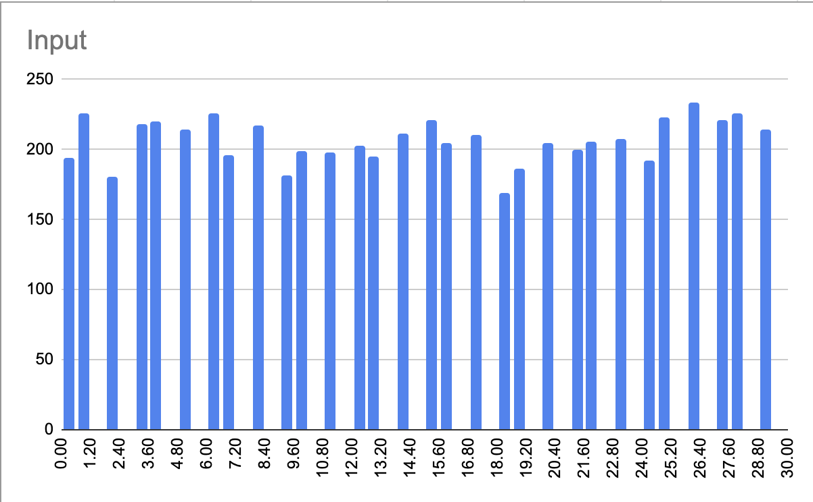
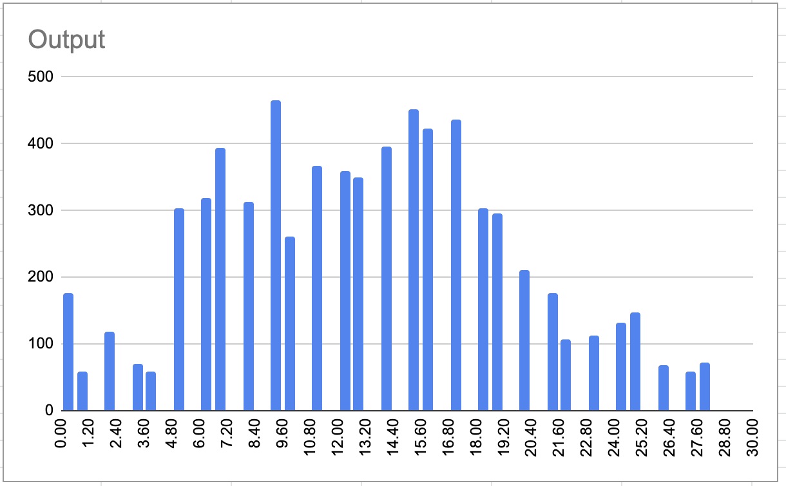

 

# Neuron 


[](https://github.com/wvabrinskas/Neuron/actions/workflows/tests.yml)

# Table of Contents 
1. [Introduction](#Introduction)
1. [Support](#Support)
1. [Brain](#The-Brain)
    1. [Nucleus](#Nucleus)
    1. [Loss Functions](#Loss-Function)
    1. [Optimizers](#Optimizer)
    1. [Gradient Descent Optimizer](#Gradient-Descent-Optimizer)
1. [Adding Layers](#Adding-Layers)
    1. [Modifiers](#Modifiers)
1. [Compiling the network](#Compiling-the-network)
1. [Training](#Training)
1. [Exporting](#Exporting-Pretrained-Models)
1. [Retrieving Data](#Retrieving-Data)
1. [Data Studying](#Data-Studying)
1. [Network Visualization](#Network-Visualization)
1. [Experimental Features](#Experimental)
    1. [GAN and WGAN](#GAN-and-WGAN-support)
    1. [Convolution / Image Recognition](#CNN)
1. [Datasets](#Datasets)
1. [TODOs](#TODOs)
1. [Resources](#Resources)


# Introduction
Neuron is a swift package I developed to help learn how to make neural networks. It is far from perfect and I am still learning. There is A LOT to learn here and I've just scratched the surface. As of right now this package provides a way to get started in machine learning and neural networks.


# Support 
[ ](https://twitter.com/wvabrinskas)

Feel free to send me suggestions on how to improve this. I would be delighted to learn more!! You can also feel free to assign issues here as well. Run the unit tests as well to learn how the project works!

## The Brain
It is fairly simple to setup the neural network `Brain`. This will be the only object you interface with. 

### Initialization
```  
  private lazy var brain: Brain = {
    let bias: Float = 0.0001
    
    let brain = Brain(learningRate: 0.01,
                      epochs: 1000,
                      lossFunction: .crossEntropy,
                      lossThreshold: TestConstants.lossThreshold,
                      initializer: .xavierNormal,
                      descent: .mbgd(size: 16),
                      metrics: [.accuracy, .loss, .valLoss])
    
    brain.addInputs(TestConstants.inputs)
    
    for _ in 0..<TestConstants.numOfHiddenLayers {
      brain.add(LobeModel(nodes: TestConstants.hidden, activation: .reLu, bias: bias)) //hidden layer
    }
    
    brain.add(LobeModel(nodes: TestConstants.outputs, activation: .softmax, bias: bias)) //output layer
        
    brain.logLevel = .none
    
    return brain
  }()
```

The `Brain` class is the main interactive class for dealing with the neural network.
The brain object also supports different log levels so you can see what's going on in the console. 

`brain.logLevel = .low` 

```
  //show no logs
  case none
  
  //show only success logs
  case low
  
  //show only success and loading logs
  case medium
  
  //show all logs
  case high
```

### Nucleus
- It first takes in a `Nucleus` object that defines the learning rate and bias for the network.   
- When defining a `bias` it is NOT applied to the input layer. 
- The `Nucleus` object takes in 2 properties `learningRate` and `bias`
    - `learningRate` - how quickly the node will adjust the weights of its inputs to fit the training model 
        - Usually between `0` and `1`. 
    - `bias` - the offset of adjustment to the weight adjustment calculation. 
        - Usually between `0` and `1`. 

### Epochs
- The number of times to run through the training data. 
- The brain object may not hit the max number of epochs before training is finished if there is validation data passed and it reaches the defined loss threshold. 

### Loss Function 
- The loss function of the network. This will determine the loss of each epoch as well as the loss of the validation data set. 
```
  case meanSquareError
  case crossEntropy
  case binaryCrossEntropy
```
- Currently the network only supports Mean Squared Error, Cross Entropy and Binary Cross Entropy loss functions 

### Loss Threshold
- The loss value the network should reach over an average of 5 epochs. 

### Weight initializers
- The initializer function the brain object should use to generate the weight values for each layer. 
```
  case xavierNormal

  case xavierUniform

  case heNormal

  case heUniform
```

### Optimizer
- The brain object can add an optimizer to the network by calling: `brain.add(optimizer:)`
```
public enum Optimizer {
  case adam(b1: Float = 0.9,
            b2: Float = 0.999,
            eps: Float = 1e-8)
}
```
- Currently only the Adam optimizer is supported. There will be more soon. 
- You can set the various hyperparameters of the optimizer through the initilization function

### Gradient Descent Optimizer
- As part of the initializer of the brain object you can specify which type of gradient descent the brain performs. 
- By default it chooses Stochastic Gradient Descent. 
```
public enum GradientDescent: Equatable {
  case sgd
  case bgd
  case mbgd(size: Int)
}
```
- The network supports Stochastic, Batch, and Mini-Batch gradient descent. 
- When adding `mbgd` you can specify the batch size.

## Adding Layers 
The brain object allows for adding layers in a module way through the `add` function. 
```
  public func add(_ model: LobeDefinition)
```
The `LobeDefinition` struct can be created with a simple initializer.
```
public protocol LobeDefinition {
  var nodes: Int { get set }
  var activation: Activation { get set }
  var bias: Float { get set }
}
```
nodes
- the number of nodes at the layer 

activation
- the activation function to be used at the layer 
- **NOTE: If the layer is of type `.input` the activation function will be ignored**

bias
- the bias to be added at that layer
- **NOTE: If the layer is of type `.input` the bias will be ignored**

`LobeModel` A normal fully connected layer model
```
// The model that defines how to construct a Lobe object
public struct LobeModel: LobeDefinition {
  public var nodes: Int
  public var activation: Activation = .none
  public var bias: Float = 0

  public init(nodes: Int,
              activation: Activation = .none,
              bias: Float = 0) {
    self.nodes = nodes
    self.activation = activation
    self.bias = bias
  }
}
```
`NormalizedLobeModel` a model that creates a lobe that incorporates batch normalization into the layer. 
```
public struct NormalizedLobeModel: LobeDefinition {
  public var nodes: Int
  public var activation: Activation
  public var bias: Float
  public var momentum: Float
  public var normalizerLearningRate: Float
  
  public init(nodes: Int,
              activation: Activation = .none,
              bias: Float = 0,
              momentum: Float,
              normalizerLearningRate: Float) {
    
    self.nodes = nodes
    self.activation = activation
    self.bias = bias
    self.momentum = momentum
    self.normalizerLearningRate = normalizerLearningRate
  }
}
```
`momentum` 
- the momentum parameter for the batch normalizer 

`normalizerLearningRate` 
- the learning rate of the batch normalizer

## Compiling the network
After adding all the specified layers and modifiers do not forget to call `compile()` on the brain object. This will connect all the layers together using the proper initializer and get the network ready for training. 

# Training
You can also train the `Brain` object by passing an expected value. 

```
  public func train(data: [TrainingData],
                    validation: [TrainingData] = [],
                    epochCompleted: ((_ epoch: Int) -> ())? = nil,
                    complete: ((_ passedValidation: Bool) -> ())? = nil)
```

- `data:` An array of `TrainingData` objects to be used as the training data set. 
- `validation:` An array of `TrainingData` objects to be used as the validation data set. 
- `epochCompleted:` A block called when an epoch has completed
- `complete` A block called when the network has finished training. 

### Training Data 
- This is the object that contains the inputs and expected output for that input
```
public struct TrainingData {
  public var data: [Float]
  public var correct: [Float]
  
  public init(data dat: [Float], correct cor: [Float]) {
    self.data = dat
    self.correct = cor
  }
}
```
### Data
- An array of values that should match the number of inputs into the network

### Correct
- A array of values that the network should target and should match the number of outputs of the network

# Importing Pretrained Models
Brain can accept a pretrained model in the form of a `.smodel` file. Basically a renamed JSON format, this is the format the Brain object will export as well. 
- This will create a fully trained Brain object that is ready to go based on the trained model passed in. 
``` 
 public init?(model: PretrainedModel,
              epochs: Int,
              lossFunction: LossFunction = .crossEntropy,
              lossThreshold: Float = 0.001,
              initializer: Initializers = .xavierNormal,
              descent: GradientDescent = .sgd) {
```

### PretrainedModel 
- The object takes in a URL to the `.smodel` file.  
```
public struct PretrainedModel: ModelBuilder {
  public var fileURL: URL
  
  public init(url file: URL) {
    self.fileURL = file
  }
  ...
```

# Exporting Pretrained Models 
The Brain object can export its current weights and setup as a `.smodel` file. This can be used to import later when creating a Brain object that you wish to be fully trained based on the data. 

```
brain.exportModelURL()
```
Will export a URL that links to the `.smodel` file.

```
brain.exportModel()
```
Will export a `ExportModel` that describes the network

# Retrieving Data
Pass in new data to feed through the network and get a result. 

```
let out = self.brain.feed(input: data)
```
- Returns `[Float]` using the new inputs and the current weights, aka. feed forward.

# Data Studying
Using the any `Trainable` object you can get the `Metrics` associated with that training session. All `Trainable`s like `Brain` and `ConvBrain` allow for capturing metrics through their initializer. Supply the list of metrics you'd like to monitor. 

```
public enum Metric: String {
  case loss = "Training Loss"
  case accuracy = "Accuracy"
  case valLoss = "Validation Loss"
  case generatorLoss = "Generator Loss"
  case criticLoss = "Critic Loss"
  case gradientPenalty = "Gradient Penalty"
}
```

 

# Network Visualization
You can now visualize your basic fully connected `Brain` network using SwiftUI and the `NetworkVisualizer` class. It will show you in some what real time what your network status is like weight values and activation values in a visual way. 

## Usage 
Create a new `NetworkVisualizer` object. 

```
public init(layerColor: Color = .red,
              randomizeLayerColors: Bool = false,
              neuronSpacing: CGFloat = 80,
              layerSpacing: CGFloat = 200)
```

`layerColor` - the color of each node in the layer 

`randomizeLayerColors` - will pick at random a color for each layer. 

`neuronSpacing` - the vertical space between each node. 

`layerSpacing` - the horizontal space between each layer.

```
let visualizer = NetworkVisualizer(randomizeLayerColors: false,
                                             neuronSpacing: 80,
                                             layerSpacing: 200)
```

- The `NetworkVisualizer` object will publish a `NetworkViewModel` object using combine anytime it's asked to update using the property: 
  -  `@Published public var viewModel: NetworkViewModel?`
- Subscribe to this property if you would like to receive updates from the `NetworkVisualizer`. 
- This viewModel is used to update the `NetworkView` 
```
visualizer.$viewModel.sink { model in
  self.visualizerViewModel = model
}.store(in: &cancellables)
```

Add the `NetworkVisualizer` to your `Brain` object. 
```
brain.visualize(visualizer)
```
- This is only thing you'll have to do. The `Brain` object will automatically update the visualizer for you. 

### Adding the view
`NetworkVisualizer` uses SwiftUI to render the views. The main view is `NetworkView`. Out of the box `NetworkView` supports panning and zooming of the network. 

```
struct ContentView: View {
  @Environment(\.networkProvider) var provider: NetworkProvider
  @State var viewModel: NetworkViewModel = NetworkViewModel()
  
  var body: some View {
    NetworkView(viewModel: viewModel)
      .onReceive(provider.$visualizerViewModel, perform: { model in
        if let model = model {
          viewModel = model
        }
      })
      .onAppear {
        provider.train()
      }
  }
}
```
- The `ContentView` contains the `@State` param that holds the `NetworkViewModel`. 
- In this case the `provider` is a demo class that contains the `Brain` object. 
- Calling `.train()` on the `Brain` object will update the `viewModel` through the `NetworkVisualizer` object.

 

**Note: It is much faster than the gif is implying**

- The darker the color the closer to `1` that value is. All values are scaled between `0...1`. 

# Experimental
These features were losely tested but I have come to the conclusion that they work enough to be released. Feel free to open an issue if they do not. 

## GAN and WGAN support 
Neuron supports Generative Adversarial Networks and Wasserstein Generative Adversarial Networks. Current Neuron doesn't support image generation with this as it doesn't support convolutional layers yet. 

### Implementation 
Create two `Brain` objects. One for the discriminator and one for the generator of the network. 

```
 private lazy var generator: Brain = {
    let bias: Float = 0
    
    let bnLearningRate: Float = 0.1
    let bnMomentum: Float = 0.99
    let normalize: Bool = true
    
    let brain = Brain(learningRate: 0.00001,
                      epochs: 1)

    brain.add(.init(nodes: generatorInputs, normalize: false))
    
    brain.add(.init(nodes: 8,
                    activation: .leakyRelu,
                    bias: bias,
                    normalize: normalize,
                    bnMomentum: bnMomentum,
                    bnLearningRate: bnLearningRate))
    
    brain.add(.init(nodes: generatorOutputs, activation: .tanh, bias: bias))

    brain.logLevel = .none
    brain.add(optimizer: .adam())
    brain.compile() //build network

    return brain
  }()
  
  private lazy var discriminator: Brain = {
    let bias: Float = 0
    let brain = Brain(learningRate: 0.00001,
                      epochs: 1)

    brain.add(.init(nodes: generatorOutputs)) 
    brain.add(.init(nodes: 15, activation: .leakyRelu, bias: bias))
    brain.add(.init(nodes: 1, activation: .leakyRelu, bias: bias))
    
    brain.logLevel = .none
    brain.add(optimizer: .adam())
    brain.compile() //build network
 
    return brain
  }()
  ```
  - The `Brain` objects are neural networks of their own and will compete to minimize the selected loss function. They are created exactly as any `Brain` object is created as mentioned above. Only thing ignored in this initializer is the `epochs`. This will be handled later. 
  - Create a `GAN` object using the two newly created networks. This creates a default `GAN` object using the `minimax` loss function. 
  ```
   let gan = GAN(epochs: 1000,
                  criticTrainPerEpoch: 4,
                  batchSize: 10,
                  metrics: [.criticLoss,
                            .gradientPenalty,
                            .generatorLoss])
    
    gan.add(generator: self.generator)
    gan.add(discriminator: self.discriminator)

    gan.logLevel = .none
  ```

  - `epochs` - number of rounds of training the GAN
  - `criticTrainPerEpoch` - the number of epochs to train the critic (discriminator) per epoch of the GAN training. 
  - `batchSize` - the number of objects to pull from the training data set per epoch. 
  - `metrics` - A `Set` that defines the metrics the `GAN` should monitor and return at the end of training.
    - Valid options are `.criticLoss`, `.generatorLoss`, and `.gradientPenalty`
  
  #### WGANGP
  You can also create a `WGANGP` object that uses the `wasserstein` loss function with `gradient penalty`. It is created in the exact same way as a `GAN` object. `WGANGP` is a subclass of `GAN` so all functions below also apply to `WGANGP`

  ```
    let gan = WGANGP(epochs: 100,
                     criticTrainPerEpoch: 5,
                     batchSize: 16,
                     metrics: [.criticLoss,
                               .gradientPenalty,
                               .generatorLoss])

  ```

  #### GAN Properties
  - `lossFunction` - the loss function for the GAN to minimize. Currentlt it only supports `wasserstein` and `minimax` loss functions. `Default: .minimax`
  - `randomNoise: () -> [Float]` - a block that the `GAN` object will call every epoch to get input data for the generator. The generator takes in random noise from a described latent space. This block is used to define that latent space. 
  - `validateGenerator: (_ output: [Float]) -> Bool` - a block that the `GAN` checks every 5 epochs to determine if it has reached it's desired output and to stop training. Returning `true` here will stop training. This block is mostly irrelevant as `GAN` training usually cannot be stopped programmatically. The `output` is the output vector from the generator at the current epoch. 
  - `discriminatorNoiseFactor` - this value is mostly useful for `minimax` loss function. This introduces a `noise` to the correct label. A value greater than 0 but less than 1 is acceptable. This will assign the correct label a value a random number based on the factor. 
    ```
    let factor = min(1.0, max(0.0, noise))
    let min = min(label, abs(label - factor))
    let max = max(label, abs(label - factor))

    let newLabel = Float.random(in: (min...max))
    ```

### Usage 
- To train the `GAN` you just call `train` on the `GAN` object you created with an array of `TrainingData` objects. Similar to any `Brain` object.

```
  self.ganBrain.train(data: trainingData) { [weak self] epoch in
      print("current epoch completed: ", epoch)
  } complete: { [weak self] metrics in
      print("critic loss: ", metrics[.criticLoss])
      print("generator loss: ", metrics[.generatorLoss])
      print("gradient penalty: ", metrics[.gradientPenalty])
  }
```

- To get generated data from the generator of the `GAN` you just call `getGeneratedSample` on your `GAN` object. This returns an array of `Float` from the generator. 
```    
let result = self.ganBrain.getGeneratedSample()
```

- You can also get data from the disrimanator to discriminate against some input data. 
```
let result = self.ganBrain.discriminate(input)
```

### GAN Data Analysis
A GAN will attempt to map between one distrubition to another. You can see below the input distribution is a normal even distribution while the output distribution from the GAN is a gaussian distribution. 

 
 

# CNN
Neuron supports Convolutional layers through the use of the `ConvBrain` class. This functions semi-similar to the `Brain` object with the exception of how to add layers. 

Call `compile()` after adding all of your layers

## Initialization
```
init(epochs: Int,
    learningRate: Float,
    bias: Float = 1.0,
    inputSize: TensorSize,
    batchSize: Int,
    optimizer: Optimizer? = nil,
    initializer: InitializerType = .heNormal,
    metrics: Set<Metric> = [])
```
`epochs` - the number of iterations over the whole dataset 

`learningRate` - the learning rate of the network

`bias` - bias for the filters 

`inputSize` - input shape of the network `TensorSize` 
  -  `typealias TensorSize = (rows: Int, columns: Int, depth: Int)`

`batchSize` - subset of the data to run mini-batch gradient descent

`optimizer` - optional optimizer of type `Optimizer` for the gradient descent, eg. `.adam()`

`initializer` - the weight initializer for the filters

`metrics` - A set of metrics to collect while training.

## Adding Layers 
### Convolutional Layer 
 - Uses `same` convolution to produce the same output dimension as the input. 
 ```
 func addConvolution(filterSize: TensorSize = (3,3,3),
                     filterCount: Int)
 ```
 `filterSize` - `TensorSize` of the filters 

 `filterCount` - Number of filters for the layer 

### Max Pooling Layer
- Uses a `2x2` stride to decrease the input size by half in each dimension except the depth. The depth will remain the same. eg. `(10,10,3) -> (5,5,3)`

```
func addMaxPool()
```

### Flatten Layer
- Takes in a `3 dimensional array` and flattens it to `1 dimension`. eg. `[[[Float]]] -> [Float]`
- There is no way to add this to the `ConvBrain` as it is added automatically when `compile()` is called. 

### Dense Layer
- Adds a fully connected layer to the `ConvBrain`. 
```
func addDense(_ count: Int, activation: Activation = .reLu)
```
`count` - number of inputs for this layer. Input layer will be automatically calculated for the fully connected portion so this can be any arbitrary number that makes sense.

`activation` - the activation function for this layer. Defualt is `relu`

### Dense Normalized Layer
- Adds a fully connected layer tp the `ConvBrain` that utilizes `BatchNormalization` prior to activation. 

```
func addDenseNormal(_ count: Int,
                    rate: Float = 0.1,
                    momentum: Float = 0.99)
```
`count` - same applies as `Dense` layer
`rate` - learning rate for the `BatchNormalizer` 
`momentum` - momentum for the `BatchNormalizer`

## Compiling 
Just run `compile()` on `ConvBrain` before attempting to train. 

## Training
- Training the Convolutional network is just as easy as training the regular fully connected network. Just call `train`. 
- One major difference is that `ConvBrain` takes in a `ConvTrainingData` object as its training data. 

ConvTrainingData
```
public struct ConvTrainingData: Equatable {
  public var data: [[[Float]]]
  public var label: [Float]
  
  public init(data: [[[Float]]], label: [Float]) {
    self.data = data
    self.label = label
  }
}
```
`data` - the data as a 3D array of `Float`. The dimensions of this array should match the `inputSize` in the `ConvBrain` 

`label` - the label of the data as a 1-hot encoded vector. The size of this array must match the number of output nodes in the fully connected portion. 

### Initializing Training 
Call `.train(data: DatasetData)` on `ConvBrain`. 
```
typealias DatasetData = (training: [ConvTrainingData], val: [ConvTrainingData])

func train(dataset: InputData,
                    epochCompleted: ((Int, [Metric : Float]) -> ())? = nil,
                    complete: (([Metric : Float]) -> ())? = nil) 
```

`data` - `InputData` is a typealias for supplying an array or training and validation datasets to the network. It is part of the `Trainable` protocol.

```
public protocol Trainable {
  associatedtype TrainableDatasetType
  typealias InputData = (training: [TrainableDatasetType], validation: [TrainableDatasetType])
  ...
```

`epochCompleted` - an optional block that is called with the completion of every epoch. An epoch is when the network has gone through every item in the training dataset.

`completed` - an optional block that is called when every epoch has been completed and the training is done. This will return the `metrics` of the network at the end.

### Feeding the Network
You can pass in a `ConvTrainingData` object into the `feed` function to get the output. 

```
func feed(data: ConvTrainingData) -> [Float]
```

`data` - The input data object. Should be the same as the `inputSize` of the `ConvBrain`

# Datasets 
`Neuron` contains some training datasets to use on a convolutional network. 

## Supplied datasets 
### MNIST 
You can build the `MNIST` dataset using the `MNIST` class provided. 
```
let mnist = MNIST()
let dataset = await mnist.build()
```
- `mnist.build()` is an asynchronous function that will build the `MNIST` dataset and return a `DatasetData` object that you can then use to train the network. 
- `MNIST` will also using `Combine` to publish the dataset to the `data` subject of the `MNIST` object.
- This will build the the `training` dataset as well as the `validation` data set. 
- `training` dataset contains `60000` items with labels
- `validation` dataset contains `10000` items with labels

# TODOs 
- GPU Acceleration is still in the works. 
- Improve convolutional layer support
- Much more... 

# Resources 

- https://towardsdatascience.com/multi-layer-neural-networks-with-sigmoid-function-deep-learning-for-rookies-2-bf464f09eb7f?gi=5b433900266a
- https://towardsdatascience.com/how-does-back-propagation-in-artificial-neural-networks-work-c7cad873ea74
- https://missinglink.ai/guides/neural-network-concepts/7-types-neural-network-activation-functions-right/
- https://github.com/nature-of-code/noc-examples-processing/blob/master/chp10_nn/NOC_10_01_SimplePerceptron/Perceptron.pde
- http://www.faqs.org/faqs/ai-faq/neural-nets/part1/preamble.html
- https://stats.stackexchange.com/questions/181/how-to-choose-the-number-of-hidden-layers-and-nodes-in-a-feedforward-neural-netw
- https://www.heatonresearch.com/book/
- https://medium.com/@yashgarg1232/derivative-of-neural-activation-function-64e9e825b67
- https://www.datasciencecentral.com/profiles/blogs/matrix-multiplication-in-neural-networks
- https://deepai.org/machine-learning-glossary-and-terms/softmax-layer //for calculating percentages from sigmoid output
- https://deepai.org/machine-learning-glossary-and-terms/sigmoid-function
- https://missinglink.ai/guides/neural-network-concepts/7-types-neural-network-activation-functions-right/
- https://arxiv.org/abs/1710.05941v1 //Swish activation function paper
- https://sefiks.com/2018/08/21/swish-as-neural-networks-activation-function/
- https://www.wandb.com/articles/fundamentals-of-neural-networks
- https://www.dlology.com/blog/quick-notes-on-how-to-choose-optimizer-in-keras/
- https://stackoverflow.com/questions/2976452/whats-is-the-difference-between-train-validation-and-test-set-in-neural-netwo
- https://www.kdnuggets.com/2017/09/neural-network-foundations-explained-activation-function.html#:~:text=Activation%20functions%20reside%20within%20neurons,values%20within%20a%20manageable%20range.
- https://towardsdatascience.com/regression-models-with-multiple-target-variables-8baa75aacd
- https://stats.stackexchange.com/questions/265905/derivative-of-softmax-with-respect-to-weights
- https://www.mldawn.com/the-derivative-of-softmaxz-function-w-r-t-z/
- https://towardsdatascience.com/optimizers-for-training-neural-network-59450d71caf6
- https://ruder.io/optimizing-gradient-descent/index.html#adam
- https://machinelearningmastery.com/multi-label-classification-with-deep-learning/
- https://medium.com/datathings/neural-networks-and-backpropagation-explained-in-a-simple-way-f540a3611f5e
- http://page.mi.fu-berlin.de/rojas/neural/chapter/K7.pdf
- https://gombru.github.io/2018/05/23/cross_entropy_loss/
- https://ml-cheatsheet.readthedocs.io/en/latest/loss_functions.html#cross-entropy
- https://peltarion.com/knowledge-center/documentation/modeling-view/build-an-ai-model/loss-functions/binary-crossentropy
- https://sefiks.com/2017/12/17/a-gentle-introduction-to-cross-entropy-loss-function/
- https://datascience.stackexchange.com/questions/27421/when-are-weights-updated-in-cnn
- https://www.jeremyjordan.me/neural-networks-training/
- https://medium.com/@pdquant/all-the-backpropagation-derivatives-d5275f727f60
- https://machinelearningmastery.com/implement-backpropagation-algorithm-scratch-python/
- https://www.cs.swarthmore.edu/~meeden/cs81/s10/BackPropDeriv.pdf
- https://www.ics.uci.edu/~pjsadows/notes.pdf
- https://stackabuse.com/creating-a-neural-network-from-scratch-in-python-multi-class-classification/

Cross Entropy + Softmax
- https://medium.com/data-science-bootcamp/understand-cross-entropy-loss-in-minutes-9fb263caee9a
- https://medium.com/data-science-bootcamp/understand-the-softmax-function-in-minutes-f3a59641e86d
- https://deepnotes.io/softmax-crossentropy

Videos: 
- https://developers.google.com/machine-learning/crash-course/multi-class-neural-networks/softmax

Cost Function vs Loss Function: 
- https://datascience.stackexchange.com/questions/65197/a-cross-entropy-loss-explanation-in-simple-words
- https://towardsdatascience.com/what-is-loss-function-1e2605aeb904

Gradient Clipping: 
- https://towardsdatascience.com/what-is-gradient-clipping-b8e815cdfb48

Activation Functions: 
- https://towardsdatascience.com/activation-functions-neural-networks-1cbd9f8d91d6
- https://xzz201920.medium.com/activation-functions-linear-non-linear-in-deep-learning-relu-sigmoid-softmax-swish-leaky-relu-a6333be712ea - shows activation functions in a chart

Backpropagation: 
- http://home.agh.edu.pl/~vlsi/AI/backp_t_en/backprop.html
- https://ml-cheatsheet.readthedocs.io/en/latest/backpropagation.html
- https://stats.stackexchange.com/questions/268561/example-of-backpropagation-for-neural-network-with-softmax-and-sigmoid-activatio
- https://ai.stackexchange.com/questions/11667/is-back-propagation-applied-for-each-data-point-or-for-a-batch-of-data-points
- 

Validation: 
- https://elitedatascience.com/overfitting-in-machine-learning
- https://machinelearningmastery.com/early-stopping-to-avoid-overtraining-neural-network-models/

Classification: 
- https://becominghuman.ai/making-a-simple-neural-network-classification-2449da88c77e

Weight Initialization
- https://prateekvishnu.medium.com/xavier-and-he-normal-he-et-al-initialization-8e3d7a087528

Optimizers

- https://machinelearningmastery.com/adam-optimization-from-scratch/
- https://towardsdatascience.com/adam-latest-trends-in-deep-learning-optimization-6be9a291375c?gi=5d9e6d09d077


Convolutional Layers: 
- https://towardsdatascience.com/a-comprehensive-guide-to-convolutional-neural-networks-the-eli5-way-3bd2b1164a53
- https://adeshpande3.github.io/A-Beginner%27s-Guide-To-Understanding-Convolutional-Neural-Networks/
- https://stanford.edu/~shervine/teaching/cs-230/cheatsheet-convolutional-neural-networks
- https://agustinus.kristia.de/techblog/2016/07/16/convnet-conv-layer/
- https://datascience.stackexchange.com/questions/27506/back-propagation-in-cnn/27751#27751
- https://stats.stackexchange.com/questions/175132/backpropagation-between-pooling-and-convolutional-layers
- https://pavisj.medium.com/convolutions-and-backpropagations-46026a8f5d2c
- https://stats.stackexchange.com/questions/361817/back-propagation-in-convolution-layer
- https://www.analyticssteps.com/blogs/common-architectures-convolution-neural-networks
- https://github.com/vzhou842/cnn-from-scratch/blob/master/conv.py
- 


Matrix Multiplication
- https://medium.com/data-science-bootcamp/understand-dot-products-matrix-multiplications-usage-in-deep-learning-in-minutes-beginner-95edf2e66155
- https://developer.apple.com/documentation/accelerate/1450313-vdsp_dotpr
- http://mirror.informatimago.com/next/developer.apple.com/documentation/Performance/Conceptual/vDSP/vDSP_Library.pdf
- 

https://commentpicker.com/random-name-generator.php

GAN 
- https://developers.google.com/machine-learning/gan/
- https://machinelearningmastery.com/how-to-implement-wasserstein-loss-for-generative-adversarial-networks/
- https://datascience.stackexchange.com/questions/32066/could-someone-explain-to-me-how-back-prop-is-done-for-the-generator-in-a-gan
- https://medium.com/intel-student-ambassadors/tips-on-training-your-gans-faster-and-achieve-better-results-9200354acaa5#:~:text=Batch%20Size%3A&text=While%20training%20your%20GAN%20use,a%20negative%20effect%20on%20training.
- https://machinelearningmastery.com/practical-guide-to-gan-failure-modes/
- https://towardsdatascience.com/generative-adversarial-network-gan-for-dummies-a-step-by-step-tutorial-fdefff170391
- https://www.cs.toronto.edu/~duvenaud/courses/csc2541/slides/gan-foundations.pdf
- https://web.njit.edu/~usman/courses/cs698_fall19/Brain2Image_%20Converting%20Brain%20Signals%20into%20Images.pdf

https://stackoverflow.com/questions/61390166/wasserstein-gan-implemtation-in-pytorch-how-to-implement-the-loss
https://github.com/keras-team/keras-contrib/issues/280
https://github.com/aadhithya/gan-zoo-pytorch/blob/master/models/wgan.py

WGAN 
- https://paper.dropbox.com/doc/Wasserstein-GAN-GvU0p2V9ThzdwY3BbhoP7
- https://www.oreilly.com/library/view/generative-deep-learning/9781492041931/ch04.html
- https://github.com/aadhithya/gan-zoo-pytorch/blob/4ca6d88107288ab23e1d65e255befe200dc0ea62/models/wgan_gp.py
- 

Batch normalization: 
- https://towardsdatascience.com/batch-normalization-in-3-levels-of-understanding-14c2da90a338
- https://towardsdatascience.com/batch-normalization-explained-algorithm-breakdown-23d2794511c
- http://kratzert.github.io/2016/02/12/understanding-the-gradient-flow-through-the-batch-normalization-layer.html
- https://deepnotes.io/batchnorm
- https://kevinzakka.github.io/2016/09/14/batch_normalization/
- https://stats.stackexchange.com/questions/312046/batch-normalization-how-to-update-gamma-and-beta-during-backpropagation-trainin HUGE HELP 
- http://www.fundza.com/vectors/normalize/
- http://mathonline.wikidot.com/the-norm-of-a-vector
- https://www.youtube.com/watch?v=tNIpEZLv_eg
Preventing Gradient Exploding / Vanishing
- https://machinelearningmastery.com/how-to-avoid-exploding-gradients-in-neural-networks-with-gradient-clipping/
- 

Natural Language Processing
- https://medium.com/@paritosh_30025/natural-language-processing-text-data-vectorization-af2520529cf7


Weight initializations: 
- https://stackoverflow.com/questions/42670274/how-to-calculate-fan-in-and-fan-out-in-xavier-initialization-for-neural-networks
- https://adityassrana.github.io/blog/theory/2020/08/26/Weight-Init.html
