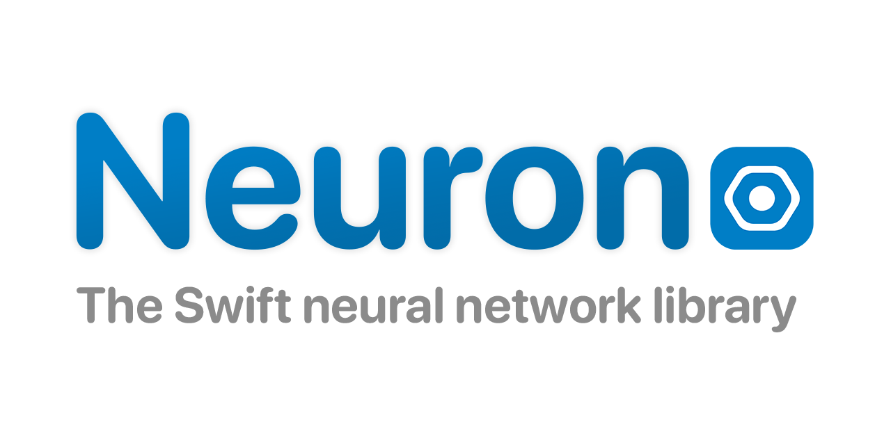

<p align="center">
 
</p>


[](https://github.com/wvabrinskas/Neuron/actions/workflows/tests.yml)

# Support 
[ ](https://twitter.com/wvabrinskas)
[](https://discord.gg/p84DYph4PW)
[](https://williamvabrinskas.com)

Feel free to send me suggestions on how to improve this. I would be delighted to learn more!! You can also feel free to assign issues here. Run the unit tests as well to learn how the project works!

[Full Documentation](https://williamvabrinskas.com/Neuron/documentation/neuron/)

# Grand Re-Opening! 

Version 2.0 of Neuron is here! This new version of Neuron is a complete rewrite from the ground up of the architecture. It is much more streamlined, with faster execution. Its usage also aligns more with commonly used ML frameworks like [Keras](https://keras.io/) and [PyTorch](https://pytorch.org/). 

# Background

Neuron has been a pet project of mine for years now. I set off to learn the basics of ML and I figured the best way to learn it was to implement it myself. I decided on Swift because it was the language I knew the most and I knew it would be challenging to optimize for ML as it has a lot of overhead. What you're seeing here in this repository is an accumulation of my work over the past 2 years or so. It is my baby. I decided to make this open source as I wanted to share what I've learned with the ML and Swift community. I wanted to give users of this framework the opportunity to learn and implement ML in their projects or apps. Have fun! 

There is still a lot missing in this framework but with this rewrite I brought a lot more flexibity to the framework to allow for playing around with different architectures and models. There are some example models provided with the framework, like Classifier, GAN, WGAN, and WGANGP. I am always working on this project and will continue to provide updates. 

# Contribution Policies
## Filing Issues
Feel free to file issues about the framework here or contact me through the [Discord](https://discord.gg/p84DYph4PW). I am open to all suggestions on how to improve the framework. 

## Pull Requests
There are automated tests that run when a PR is created to the `develop` or `master` branches. These tests must pass before a PR can be merged. All PRs must merge into the `develop` branch. 
## Branching
All features must be branched off the `develop` branch. 

# Important Note: GPU Support (WIP)
Currently there is no GPU execution, at least not as how I would like it. Everything runs on the CPU, with some C optimizations for certain mathematical functions. Neuron will run multithreaded on the CPU with somewhat decent speed depending on the model. However a very large model with serveral kernels and convolutions will take a while. This is something I want to get working ASAP however Metal is very difficult to work with, especially with my limited knowledge and my desire to write everything from scratch. 
# Usage Background

## Tensor
The main backbone of Neuron is the `Tensor` object. This object is basically a glorified 3D array of numbers. All `Tensor` objects are 3D arrays however they can contain any type of array in-between. Its size is defined by a `TensorSize` object defining `columns`, `rows`, `depth`.

```
public class Tensor: Equatable, Codable {
  ...
    
  public init() {
    self.value = []
    self.context = TensorContext()
  }
  
  public init(_ data: Scalar? = nil, context: TensorContext = TensorContext()) {
    if let data = data {
      self.value = [[[data]]]
    } else {
      self.value = []
    }
    
    self.context = context
  }
  
  public init(_ data: [Scalar], context: TensorContext = TensorContext()) {
    self.value = [[data]]
    self.context = context
  }
  
  public init(_ data: [[Scalar]], context: TensorContext = TensorContext()) {
    self.value = [data]
    self.context = context
  }
  
  public init(_ data: Data, context: TensorContext = TensorContext()) {
    self.value = data
    self.context = context
  }
}
```

Above are the initializers that `Tensor` supports. More in-depth documentation on `Tensor` can be found [here](https://williamvabrinskas.com/Neuron/documentation/neuron/tensor). 

### Arithmetic
You can perform basic arithmetic opterations directly to a `Tensor` object as well. 
```
static func * (Tensor, Tensor.Scalar) -> Tensor
static func * (Tensor, Tensor) -> Tensor
static func + (Tensor, Tensor) -> Tensor
static func + (Tensor, Tensor.Scalar) -> Tensor
static func - (Tensor, Tensor.Scalar) -> Tensor
static func - (Tensor, Tensor) -> Tensor
static func / (Tensor, Tensor.Scalar) -> Tensor
static func / (Tensor, Tensor) -> Tensor
static func == (Tensor, Tensor) -> Bool
```

### Building a backpropagation graph
You can attach a `Tensor` to another `Tensor`'s graph by calling `setGraph(_ tensor: Tensor)` on the `Tensor` whose `graph` you'd like to set. 

```
let inputTensor = Tensor([1,2,3,4])
var outputTensor = Tensor([2])

outputTensor.setGraph(inputTensor)
```

Doing so will set the `inputTensor` as the `graph` to the `outputTensor`. This means that when calling `.gradients` on the `outputTensor` the operation will look as such: 

```
delta -> outputTensor.context(inputTensor) -> gradients w.r.t to inputTensor
```

Unless you're building a graph yourself or doing something custom, you'll never have to set a graph yourself. This will be handled by the `Sequential` object.

### Gradients
More in-depth `TensorContext` documentation can be found [here](https://williamvabrinskas.com/Neuron/documentation/neuron/tensorcontext).

Neuron performs gradient descent operations using `Tensor` objects and their accompanying `TensorContext`.
`Tensor` objects contain an internal property called `context` which is of type `TensorContext`. `TensorContext` is an object that contains the backpropagtion information for that given `Tensor`. As of right now Neuron doesn't have a full auto-grad setup yet however `Tensor` objects with their `TensorContext` provides some type of auto-grad. 

```
public struct TensorContext: Codable {
  public typealias TensorBackpropResult = (input: Tensor, weight: Tensor)
  public typealias TensorContextFunction = (_ inputs: Tensor, _ gradient: Tensor) -> TensorBackpropResult
  var backpropagate: TensorContextFunction
  
  public init(backpropagate: TensorContextFunction? = nil) {
    let defaultFunction = { (input: Tensor, gradient: Tensor) in
      return (Tensor(gradient.value), Tensor())
    }
    
    self.backpropagate = backpropagate ?? defaultFunction
  }
  
  public func encode(to encoder: Encoder) throws {}
  
  public init(from decoder: Decoder) throws {
    self = TensorContext()
  }
}
```

When calling `.gradients(delta: SomeTensor)` on a `Tensor` that has an attached `graph` it wil automatically backpropagate all the way through the `graph` and return a `Tensor.Gradient` object. 

```
public struct Gradient {
  let input: [Tensor]
  let weights: [Tensor]
  let biases: [Tensor]
  
  public init(input: [Tensor] = [],
              weights: [Tensor] = [],
              biases: [Tensor] = []) {
    self.input = input
    self.weights = weights
    self.biases = biases
  }
}
```

A `Tensor.Gradient` object will contain all the gradients you'll need to perform a backpropagation step in the `Optimizer`. This object contains gradients w.r.t the `input`, w.r.t the `weights`, and w.r.t the `biases` of the graph. 