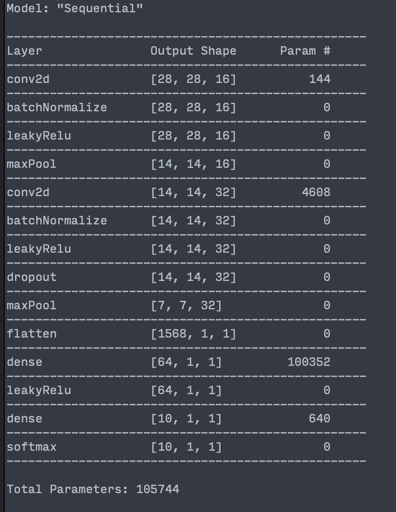

<p align="center">
 
</p>


[](https://github.com/wvabrinskas/Neuron/actions/workflows/tests.yml)

<a href="https://www.emergetools.com/app/example/ios/Neuron/release?utm_campaign=badge-data"></a>

# Sponsors
We are incredibly grateful for the support of our sponsors

<a href="https://www.emergetools.com"></a>

# Become a Sponsor
To become a sponsor and support the development of Neuron, simply click on the "Sponsor" button at the top of this GitHub repository.

# Support 
[ ](https://twitter.com/wvabrinskas)
[](https://discord.gg/p84DYph4PW)
[](https://williamvabrinskas.com)

Feel free to send me suggestions on how to improve this. I would be delighted to learn more!! You can also feel free to assign issues here. Run the unit tests as well to learn how the project works!

[Full Documentation](https://williamvabrinskas.com/Neuron/documentation/neuron/)

# Important Developer Note!

## When using Neuron it operates about 10X faster when you run with a `RELEASE` scheme. This is due to the compiler optimizations being set to the highest optimization value. If you find Neuron is running somewhat slowly this might be a reason why. 

# Before you begin developing
Run `./scripts/onboard.sh` to install the Xcode templates that `Neuron` provides to quickly generate layer code templates.

# Contribution Policies
## Filing Issues
Feel free to file issues about the framework here or contact me through the [Discord](https://discord.gg/p84DYph4PW). I am open to all suggestions on how to improve the framework. 

## Pull Requests
There are automated tests that run when a PR is created to the `develop` or `master` branches. These tests must pass before a PR can be merged. All PRs must merge into the `develop` branch. 
## Branching
All features must be branched off the `develop` branch. 

# Background

Neuron has been a pet project of mine for years now. I set off to learn the basics of ML and I figured the best way to learn it was to implement it myself. I decided on Swift because it was the language I knew the most and I knew it would be challenging to optimize for ML as it has a lot of overhead. What you're seeing here in this repository is an accumulation of my work over the past 2 years or so. It is my baby. I decided to make this open source as I wanted to share what I've learned with the ML and Swift community. I wanted to give users of this framework the opportunity to learn and implement ML in their projects or apps. Have fun! 

There is still a lot missing in this framework but with this rewrite I brought a lot more flexibity to the framework to allow for playing around with different architectures and models. There are some example models provided with the framework, like Classifier, GAN, WGAN, and WGANGP. I am always working on this project and will continue to provide updates. 

# Sample projects 

[Neuron Demo](https://github.com/wvabrinskas/NeuronDemo)
- A "Get Started with Neuron" project. Should help with the learning the basics of the framework.

[PokePal](https://github.com/wvabrinskas/PokePal)
- An example project that uses a pre-trained model and your camera to identify all Pokemon currently.

# Examples
## GAN, WGAN, WGANGP

Generated 7's from a WGAN. Trained on MNIST 7's for 10 epochs. 16 - 32 kernels on the generator. 


# Important Note: GPU Support (WIP)
Currently there is no GPU execution, at least not as how I would like it. Everything runs on the CPU, with some C optimizations for certain mathematical functions. Neuron will run multithreaded on the CPU with somewhat decent speed depending on the model. However a very large model with serveral kernels and convolutions will take a while. This is something I want to get working ASAP however Metal is very difficult to work with, especially with my limited knowledge and my desire to write everything from scratch. 

# Quick Start Guide
To get started with Neuron it all begins with setting up a `Sequential` object. This object is responsible for organizing the forward and backward passes through the network. 

## Build a Network
Let's build an `MNIST` classifier network. We need to build a `Sequential` object to handle our layers.

```swift
let network = Sequential {
  [
    Conv2d(filterCount: 16,
            inputSize: TensorSize(array: [28,28,1]),
            padding: .same,
            initializer: initializer),
    BatchNormalize(),
    LeakyReLu(limit: 0.2),
    MaxPool(),
    Conv2d(filterCount: 32,
            padding: .same,
            initializer: initializer),
    BatchNormalize(),
    LeakyReLu(limit: 0.2),
    Dropout(0.5),
    MaxPool(),
    Flatten(),
    Dense(64, initializer: initializer),
    LeakyReLu(limit: 0.2),
    Dense(10, initializer: initializer),
    Softmax()
  ]
}
```

`Sequential` takes in one property which is block that returns an array of `Layer` types. `init(_ layers: () -> [Layer])`. The order here matters. The first layer is a `Conv2d` layer with 16 filters, padding `.same`, and an initializer. The default initializer is `.heNormal`. 

### *First layer note*:
You can see here the first layer is the only layer where the `inputSize` is specified. This is because all the other layer's `inputSize` are automatically calculated when added to an `Optimizer`. 

## Picking an Optimizer
Neuron uses a `protocol` that defines what's needed for an `Opitmizer`. There are currently three provided optimizers bundled with Neuron. 
- `Adam`
- `SGD`
- `RMSProp`

All optimizers are interchangeable. Optimizers are the "brain" of the network. All function calls to train the network should be called through your specific `Optimizer`. Let's build an `Adam` optimizer for this classifier. 

```swift
let optim = Adam(network,
                 learningRate: 0.0001,
                 l2Normalize: false)
```

The first parameter here is the network we defined above. `learningRate` is the the size of the steps the optimizer will take when `.step()` is called. `l2Normalize` defines if the optimizer will normalize the gradients before they are applied to the weights. Default value for this is `false`. `Adam` also takes in properties for its `beta1`, `beta2`, and `epsilon` properties. 

### Decay Functions
An `Optimizer` has an optional property for setting a learning rate decay function. 
```swift
public protocol DecayFunction {
  var decayedLearningRate: Tensor.Scalar { get }
  func reset()
  func step()
}
```
Currently there's only one available `DecayFunction` and that's `ExponentialDecay`. You can set a decay function by setting the `decayFunction` property on the `Optimizer`. Once it's set there's nothing else that needs to be done. The `Optimizer` with take care of updating and calling the function object.

## Set up training model
By this point you are ready to train the `Optimizer` and the network. You could create your own training cycle to create the classifier or you can use the built in provided `Classifier` model. 

The `Classifier` model is a completely optional class that does a lot of the heavy lifting for you when training the network. Let's use that for now.

```swift
let classifier = Classifier(optimizer: optim,
                            epochs: 10,
                            batchSize: 32,
                            threadWorkers: 8,
                            log: false)
```

Here we create a `Classifier` object. We pass in the `Adam Optimizer` we defined earlier, the number of `epochs` to train for, the batch size, and the number of `multi-threaded` workers to use. `8` or `16` is usually a good enough number for this. This will split the batch up over multiple threads allowing for faster exectution. 

### Building the MNIST dataset

*NOTE: Be sure to import [NeuronDatasets](https://github.com/wvabrinskas/NeuronDatasets) to get the `MNIST` and other datasets.*

Next step to get the `MNIST` dataset. Neuron provides this locally to you through the `MNIST()` object.

```swift
let data = await MNIST().build()
```

We can use the `Async/Await` build function for simplicity. `Datasets` also support `Combine` publishers.

## Time to train!
To train the network using the `Classifier` object just call `    classifier.fit(data.training, data.val)`. That's it! The `Classifier` will now train for the specified number of `epochs` and report to the `MetricProvider` if set. 
## Retrieving Metrics
All `Optimizers` support the addition of a `MetricsReporter` object. This object will track all metrics you ask it to during the initialization. If the metric isn't supported by your netowrk setup it will report a `0`. 

```swift
let reporter = MetricsReporter(frequency: 1,
                                metricsToGather: [.loss,
                                                  .accuracy,
                                                  .valAccuracy,
                                                  .valLoss])

optim.metricsReporter = reporter

optim.metricsReporter?.receive = { metrics in
  let accuracy = metrics[.accuracy] ?? 0
  let loss = metrics[.loss] ?? 0
  //let valLoss = metrics[.valLoss] ?? 0
  
  print("training -> ", "loss: ", loss, "accuracy: ", accuracy)
}
```

The `metricsToGather` array is a `Set` of `Metric` definitions. 

```swift
public enum Metric: String {
  case loss = "Training Loss"
  case accuracy = "Accuracy"
  case valLoss = "Validation Loss"
  case generatorLoss = "Generator Loss"
  case criticLoss = "Critic Loss"
  case gradientPenalty = "Gradient Penalty"
  case realImageLoss = "Real Image Loss"
  case fakeImageLoss = "Fake Image Loss"
  case valAccuracy = "Validation Accuracy"
}
```

`MetricReporter` will call `receive` when it is updated. 

### Remote metric logging

You can use the [NeuronRemoteLogger](https://github.com/wvabrinskas/NeuronRemoteLogger) to log to remote services like [Weights and Biases](https://wandb.ai/). Follow the instructions in the `README` in that repo on how to get started! 

## Exporting your model

Once the model has trained to your liking you can export the model to a `.smodel` file. This model cvan be then imported later using the `Sequential` intializer. The export will not export your `Optimizer` settings, only the `Trainable` specified in the `Optimizer`. 

Neuron provides a helper object for exporting called `ExportHelper`. The usage is simple: 

```swift
// defined: 
public static func getModel<T: Codable>(filename: String = "model", model: T) -> URL?

// usage:
ExportHelper.export(filename: "my_model", model: network)
```

This will return a `URL` for you to access your `.smodel` file. 

### Pretty-print your network
You can also print your network to the console by calling `print` on the `Sequential` object. It will pretty print your network as below:

 


## Finishing up
Keep playing around with your new model and enjoy the network! Share your model on the Discord or ask for some other models that others have made! 
# Basics Background
## How does Neuron work?

## Tensor
The core data structure in Neuron is `Tensor`. It is still conceptually a 3D tensor, but the internal architecture is now optimized around flat contiguous storage.

### Tensor architecture (current)
- `Tensor` is a reference type (`class`) and is `Codable`.
- Data is stored in `storage: ContiguousArray<Tensor.Scalar>`.
- Shape is stored in `size: TensorSize` (`columns`, `rows`, `depth`).
- `shape` returns `[columns, rows, depth]`.
- Indexing uses flat row-major depth slices:
  - `index = d * rows * columns + r * columns + c`

This is significantly faster and avoids repeated nested-array allocations in hot paths.

```swift
public class Tensor: Equatable, Codable {
  public typealias Value = ContiguousArray<Scalar>

  public internal(set) var storage: Tensor.Value
  public internal(set) var size: TensorSize
  internal let context: TensorContext
  internal var graph: [ID: Tensor] = [:]
  internal var graphChain: Set<ID> = []
}
```

Common initializers:

```swift
Tensor()                                  // empty
Tensor(Tensor.Scalar(1.0))                // scalar: 1x1x1
Tensor([1, 2, 3])                         // 1D -> columns x 1 x 1
Tensor([[1, 2], [3, 4]])                  // 2D -> columns x rows x 1
Tensor([[[...]]])                         // 3D
Tensor(storage, size: someTensorSize)     // direct flat-storage init
```

More in-depth documentation on `Tensor` is [here](https://williamvabrinskas.com/Neuron/documentation/neuron/tensor).

### Building a graph
Each output tensor stores links to parent tensors through `setGraph(_:)` (or internally `setGraphSafe(_:)` for cycle protection). In normal model training you usually do not need to call this manually; layers and `Sequential` wire the graph for you.

```swift
let input = Tensor([1, 2, 3, 4])
let output = input * input
// output now has graph connections to input tensors
```

## Gradients
More in-depth `TensorContext` documentation can be found [here](https://williamvabrinskas.com/Neuron/documentation/neuron/tensorcontext).

### What is `TensorContext`?
`TensorContext` is the local backprop rule attached to a tensor. Its job is to answer:

> “Given upstream gradient `dL/dOut`, what are `dL/dInput`, `dL/dWeight`, and `dL/dBias` for this operation?”

```swift
public struct TensorContext: Codable {
  public typealias TensorBackpropResult = (input: Tensor, weight: Tensor, bias: Tensor)
  public typealias TensorContextFunction = (_ inputs: Tensor, _ gradient: Tensor, _ wrt: Tensor?) -> TensorBackpropResult
}
```

Purpose of `TensorContext`:
- Encapsulates the derivative logic for one node/operation.
- Keeps the chain rule local to where the forward op was created.
- Lets the same graph walker work for tensor ops and trainable layers.
- Returns parameter gradients (`weight`, `bias`) when applicable.

If no custom context is provided, the default behavior passes the incoming gradient through to `input` and returns empty weight/bias tensors.

### Which functions currently have autograd?
Autograd is currently implemented where a new tensor is created with a `TensorContext` and graph links.

Tensor-level autograd (`Tensor` ↔ `Tensor`):
- `static func + (Tensor, Tensor) -> Tensor`
- `static func - (Tensor, Tensor) -> Tensor`
- `static func * (Tensor, Tensor) -> Tensor`
- `static func / (Tensor, Tensor) -> Tensor`
- Broadcasting paths used by those operators:
  - `addAlong(axis:value:)`
  - `subtractAlong(axis:value:)`
  - `multiplyAlong(axis:value:)`
  - `divideAlong(axis:value:)`

Layer-level autograd (forward creates output `TensorContext`):
- `Dense`, `Conv2d`, `BatchNormalize`, `LayerNormalize`
- `MaxPool`, `AvgPool`, `GlobalAveragePool`
- `Dropout`, `Flatten`, `Reshape`
- `Embedding`, `LSTM`, `ResNet`
- Activation forwards (`BaseActivationLayer`) and `Softmax` override

Important note: scalar overloads like `Tensor + Scalar` or utility math/reduction helpers do not create a new autograd node by themselves. Most training gradients come from layer forward contexts and tensor-tensor ops listed above.

### How `.gradients(delta:wrt:)` is calculated
Calling:

```swift
let g = output.gradients(delta: lossGradient, wrt: inputTensor)
```

does the following:

1. Starts at `output` and calls its local context backprop function for each direct parent in `output.graph`.
2. Collects returned gradients into three arrays:
   - input gradients
   - weight gradients
   - bias gradients
3. Uses the returned input gradients as the new upstream gradients for the next graph level.
4. Repeats level-by-level until the graph is exhausted.
5. If `wrt` is provided, traversal is filtered to branches whose `graphChain` contains that tensor, and stops once that tensor is reached.

So the chain rule is applied as:

```
upstream delta
  -> current tensor context.backpropagate(...)
  -> propagated input deltas
  -> next parent contexts
  -> ...
```

### `Tensor.Gradient` (TensorGradients)
`Tensor.gradients(...)` returns `Tensor.Gradient`, which packages:
- gradients w.r.t. graph inputs
- gradients w.r.t. trainable weights
- gradients w.r.t. trainable biases

These are what the optimizer consumes to update model parameters.

### Batch gradient accumulation
`GradientAccumulator` collects per-example `Tensor.Gradient` values and can average them across a batch before optimizer application. This is the object used inside optimizer training loops to merge gradients safely.
