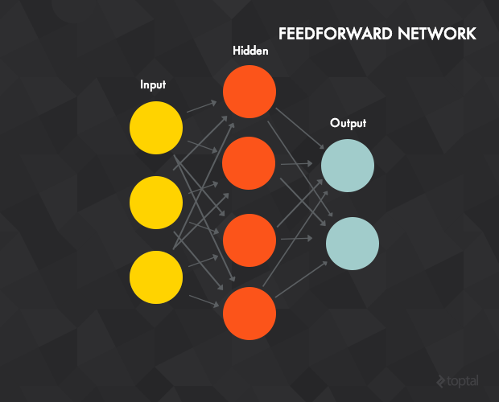
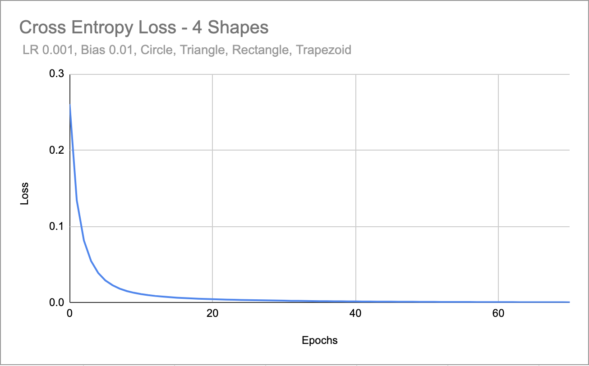

 

# Neuron 


[](https://github.com/wvabrinskas/Neuron/actions/workflows/tests.yml)

# Introduction
Neuron is a swift package I developed to help learn how to make neural networks. It is far from perfect and I am still learning. There is A LOT to learn here and I've just scratched the surface. As of right now this package provides a way to get started in machine learning and neural networks.



# Support 
[ ](https://twitter.com/wvabrinskas)

Feel free to send me suggestions on how to improve this. I would be delighted to learn more!! You can also feel free to assign issues here as well. Run the unit tests as well to learn how the project works!

## The Brain
It is fairly simple to setup the neural network `Brain`. This will be the only object you interface with. 

### Initialization
```  
  private lazy var brain: Brain = {
    let bias = 0.01

    let nucleus = Nucleus(learningRate: 0.001,
                          bias: 0.001)
    
    let brain = Brain(nucleus: nucleus,
                      epochs: 10,
                      lossFunction: .crossEntropy,
                      lossThreshold: 0.001, 
                      initializer: .xavierNormal, 
                      gradient: .sgd)
    
    brain.add(.init(nodes: inputs, bias: bias)) //input layer

    for _ in 0..<numOfHiddenLayers {
      brain.add(.init(nodes: hidden, activation: .reLu, bias: bias)) 
    }
    
    brain.add(.init(nodes: outputs, bias: bias)) //output layer
    
    brain.add(modifier: .softmax)

    brain.add(optimizer: .adam())

    brain.logLevel = .high
    
    return brain
  }()
```

The `Brain` class is the main interactive class for dealing with the neural network.
The brain object also supports different log levels so you can see what's going on in the console. 

`brain.logLevel = .low` 

```
  //show no logs
  case none
  
  //show only success logs
  case low
  
  //show only success and loading logs
  case medium
  
  //show all logs
  case high
```

### Nucleus
- It first takes in a `Nucleus` object that defines the learning rate and bias for the network.   
- When defining a `bias` it is NOT applied to the input layer. 
- The `Nucleus` object takes in 2 properties `learningRate` and `bias`
    - `learningRate` - how quickly the node will adjust the weights of its inputs to fit the training model 
        - Usually between `0` and `1`. 
    - `bias` - the offset of adjustment to the weight adjustment calculation. 
        - Usually between `0` and `1`. 

### Epochs
- The number of times to run through the training data. 
- The brain object may not hit the max number of epochs before training is finished if there is validation data passed and it reaches the defined loss threshold. 

### Loss Function 
- The loss function of the network. This will determine the loss of each epoch as well as the loss of the validation data set. 
```
  case meanSquareError
  case crossEntropy
```
- Currently the network only supports Mean Squared Error and Cross Entropy loss functions 

### Loss Threshold
- The loss value the network should reach over an average of 5 epochs. 

### Initializer 
- The initializer function the brain object should use to generate the weight values for each layer. 
```
  ///Generates weights based on a normal gaussian distribution. Mean = 0 sd = 1
  case xavierNormal

  ///Generates weights based on a uniform distribution
  case xavierUniform
```
- Currently the network supports Xavier normal distribution and Xavier uniform distribution 

### Optimizer
- The brain object can add an optimizer to the network by calling: `brain.add(optimizer:)`
```
public enum Optimizer {
  case adam(b1: Float = 0.9,
            b2: Float = 0.999,
            eps: Float = 1e-8)
}
```
- Currently only the Adam optimizer is supported. There will be more soon. 
- You can set the various hyperparameters of the optimizer through the initilization function

### Gradient Descent Optimizer
- As part of the initializer of the brain object you can specify which type of gradient descent the brain performs. 
- By default it chooses Stochastic Gradient Descent. 
```
public enum GradientDescent: Equatable {
  case sgd
  case mbgd(size: Int)
}
```
- The network supports both Stochastic and Mini-Batch gradient descent. 
- When adding `mbgd` you can specify the batch size.

## Adding Layers 
The brain object allows for adding layers in a module way through the `add` function. 
```
  public func add(_ model: LobeModel)
```
The `LobeModel` struct can be created with a simple initializer. 
```
  public init(nodes: Int,
              activation: Activation = .none,
              bias: Float = 0) {
    self.nodes = nodes
    self.activation = activation
    self.bias = bias
  }
  ```

Nodes
- the number of nodes at the layer 

Activation
- the activation function to be used at the layer 
- **NOTE: If the layer is of type `.input` the activation function will be ignored**

Bias
- the bias to be added at that layer
- **NOTE: If the layer is of type `.input` the bias will be ignored**


### Modifiers 
The network also supports adding an output activation modifier such as softmax 

```
  public func add(modifier mod: OutputModifier) {
    self.outputModifier = mod
  }
```

- Calling `add(modifier)` on the brain object will add the specified output activation to the output layer. 
- Currently the network on supports Softmax 
```
  case softmax
```

## Compiling the network
After adding all the specified layers and modifiers do not forget to call `compile()` on the brain object. This will connect all the layers together using the proper initializer and get the network ready for training. 

# Training
You can also train the `Brain` object by passing an expected value. 

```
public func train(data: [TrainingData],
                    validation: [TrainingData] = [],
                    complete: ((_ complete: Bool) -> ())? = nil)
```

- `data:` An array of `TrainingData` objects to be used as the training data set. 
- `validation:` An array of `TrainingData` objects to be used as the validation data set. 
- `complete` A block called when the network has finished training. 

### Training Data 
- This is the object that contains the inputs and expected output for that input
```
public struct TrainingData {
  public var data: [Float]
  public var correct: [Float]
  
  public init(data dat: [Float], correct cor: [Float]) {
    self.data = dat
    self.correct = cor
  }
}
```
### Data
- An array of values that should match the number of inputs into the network

### Correct
- A array of values that the network should target and should match the number of outputs of the network

# Importing Pretrained Models
Brain can accept a pretrained model in the form of a `.smodel` file. Basically a renamed JSON format, this is the format the Brain object will export as well. 
- This will create a fully trained Brain object that is ready to go based on the trained model passed in. 
``` 
 public init?(model: PretrainedModel,
              epochs: Int,
              lossFunction: LossFunction = .crossEntropy,
              lossThreshold: Float = 0.001,
              initializer: Initializers = .xavierNormal) {
```

### PretrainedModel 
- The object takes in a URL to the `.smodel` file.  
```
public struct PretrainedModel: ModelBuilder {
  public var fileURL: URL
  
  public init(url file: URL) {
    self.fileURL = file
  }
  ...
```

# Exporting Pretrained Models 
The Brain object can export its current weights and setup as a `.smodel` file. This can be used to import later when creating a Brain object that you wish to be fully trained based on the data. 

```
brain.exportModelURL()
```
Will export a URL that links to the `.smodel` file.

```
brain.exportModel()
```
Will export a `ExportModel` that describes the network

# Retrieving Data
Pass in new data to feed through the network and get a result. 

```
let out = self.brain.feed(input: data)
```
- Returns `[Float]` using the new inputs and the current weights, aka. feed forward.

# Data Studying
Using the `Brain` object you can also get the result of the loss functions of each epoch as a `CSV` file using the `exportLoss` function on `Brain`. 
- `exportLoss(_ filename: String? = nil) -> URL?`
- `filename:` Name of the file to save and export. defaults to `loss-{timeIntervalSince1970}`
- Returns the url of the exported file if successful.

- Example graph:

 

# TODOs 
- GPU Acceleration is still in the works. 
- Convolutional layer support
- Much more... 

# Resources 

- [Make Your Own Neural Network - Tariq Rashid](https://www.amazon.com/Make-Your-Own-Neural-Network-ebook/dp/B01EER4Z4G)
- http://www.faqs.org/faqs/ai-faq/neural-nets/part1/preamble.html
- https://stats.stackexchange.com/questions/181/how-to-choose-the-number-of-hidden-layers-and-nodes-in-a-feedforward-neural-netw
- https://www.heatonresearch.com/book/
- http://home.agh.edu.pl/~vlsi/AI/backp_t_en/backprop.html
- https://medium.com/@yashgarg1232/derivative-of-neural-activation-function-64e9e825b67
- https://www.datasciencecentral.com/profiles/blogs/matrix-multiplication-in-neural-networks
- https://sefiks.com/2018/08/21/swish-as-neural-networks-activation-function/
- https://www.wandb.com/articles/fundamentals-of-neural-networks
- https://www.dlology.com/blog/quick-notes-on-how-to-choose-optimizer-in-keras/
- https://towardsdatascience.com/multi-layer-neural-networks-with-sigmoid-function-deep-learning-for-rookies-2-bf464f09eb7f?gi=5b433900266a
- https://towardsdatascience.com/how-does-back-propagation-in-artificial-neural-networks-work-c7cad873ea74
- https://github.com/nature-of-code/noc-examples-processing/blob/master/chp10_nn/NOC_10_01_SimplePerceptron/Perceptron.pde
- http://www.faqs.org/faqs/ai-faq/neural-nets/part1/preamble.html
- https://stats.stackexchange.com/questions/181/how-to-choose-the-number-of-hidden-layers-and-nodes-in-a-feedforward-neural-netw
- https://www.heatonresearch.com/book/
- https://medium.com/@yashgarg1232/derivative-of-neural-activation-function-64e9e825b67
- https://www.datasciencecentral.com/profiles/blogs/matrix-multiplication-in-neural-networks
- https://deepai.org/machine-learning-glossary-and-terms/softmax-layer 
- https://deepai.org/machine-learning-glossary-and-terms/sigmoid-function
- https://missinglink.ai/guides/neural-network-concepts/7-types-neural-network-activation-functions-right/
- https://arxiv.org/abs/1710.05941v1
- https://sefiks.com/2018/08/21/swish-as-neural-networks-activation-function/
- https://www.wandb.com/articles/fundamentals-of-neural-networks
- https://www.dlology.com/blog/quick-notes-on-how-to-choose-optimizer-in-keras/
- https://stackoverflow.com/questions/2976452/whats-is-the-difference-between-train-validation-and-test-set-in-neural-netwo
- https://www.kdnuggets.com/2017/09/neural-network-foundations-explained-activation-function.html#:~:text=Activation%20functions%20reside%20within%20neurons,values%20within%20a%20manageable%20range.
- https://towardsdatascience.com/regression-models-with-multiple-target-variables-8baa75aacd
- https://stats.stackexchange.com/questions/265905/derivative-of-softmax-with-respect-to-weights
- https://www.mldawn.com/the-derivative-of-softmaxz-function-w-r-t-z/
- https://towardsdatascience.com/optimizers-for-training-neural-network-59450d71caf6
- https://ruder.io/optimizing-gradient-descent/index.html#adam
- https://machinelearningmastery.com/multi-label-classification-with-deep-learning/
- https://medium.com/datathings/neural-networks-and-backpropagation-explained-in-a-simple-way-f540a3611f5e
- http://page.mi.fu-berlin.de/rojas/neural/chapter/K7.pdf
- https://gombru.github.io/2018/05/23/cross_entropy_loss/
- https://ml-cheatsheet.readthedocs.io/en/latest/loss_functions.html#cross-entropy
- https://peltarion.com/knowledge-center/documentation/modeling-view/build-an-ai-model/loss-functions/binary-crossentropy
- https://sefiks.com/2017/12/17/a-gentle-introduction-to-cross-entropy-loss-function/
- https://datascience.stackexchange.com/questions/27421/when-are-weights-updated-in-cnn
- https://www.jeremyjordan.me/neural-networks-training/
- https://medium.com/@pdquant/all-the-backpropagation-derivatives-d5275f727f60
- https://machinelearningmastery.com/implement-backpropagation-algorithm-scratch-python/
- https://www.cs.swarthmore.edu/~meeden/cs81/s10/BackPropDeriv.pdf
- https://www.ics.uci.edu/~pjsadows/notes.pdf
- https://stackabuse.com/creating-a-neural-network-from-scratch-in-python-multi-class-classification/

Cross Entropy + Softmax
- https://medium.com/data-science-bootcamp/understand-cross-entropy-loss-in-minutes-9fb263caee9a
- https://medium.com/data-science-bootcamp/understand-the-softmax-function-in-minutes-f3a59641e86d
- https://deepnotes.io/softmax-crossentropy

Videos: 
- https://developers.google.com/machine-learning/crash-course/multi-class-neural-networks/softmax

Cost Function vs Loss Function: 
- https://datascience.stackexchange.com/questions/65197/a-cross-entropy-loss-explanation-in-simple-words
- https://towardsdatascience.com/what-is-loss-function-1e2605aeb904

Gradient Clipping: 
- https://towardsdatascience.com/what-is-gradient-clipping-b8e815cdfb48

Activation Functions: 
- https://towardsdatascience.com/activation-functions-neural-networks-1cbd9f8d91d6

Backpropagation: 
- http://home.agh.edu.pl/~vlsi/AI/backp_t_en/backprop.html
- https://ml-cheatsheet.readthedocs.io/en/latest/backpropagation.html
- https://stats.stackexchange.com/questions/268561/example-of-backpropagation-for-neural-network-with-softmax-and-sigmoid-activatio

Validation: 
- https://elitedatascience.com/overfitting-in-machine-learning
- https://machinelearningmastery.com/early-stopping-to-avoid-overtraining-neural-network-models/

Classification: 
- https://becominghuman.ai/making-a-simple-neural-network-classification-2449da88c77e

Weight Initialization
- https://prateekvishnu.medium.com/xavier-and-he-normal-he-et-al-initialization-8e3d7a087528

Optimizers
- https://medium.com/datadriveninvestor/overview-of-different-optimizers-for-neural-networks-e0ed119440c3
- https://ruder.io/optimizing-gradient-descent/index.html#adam
